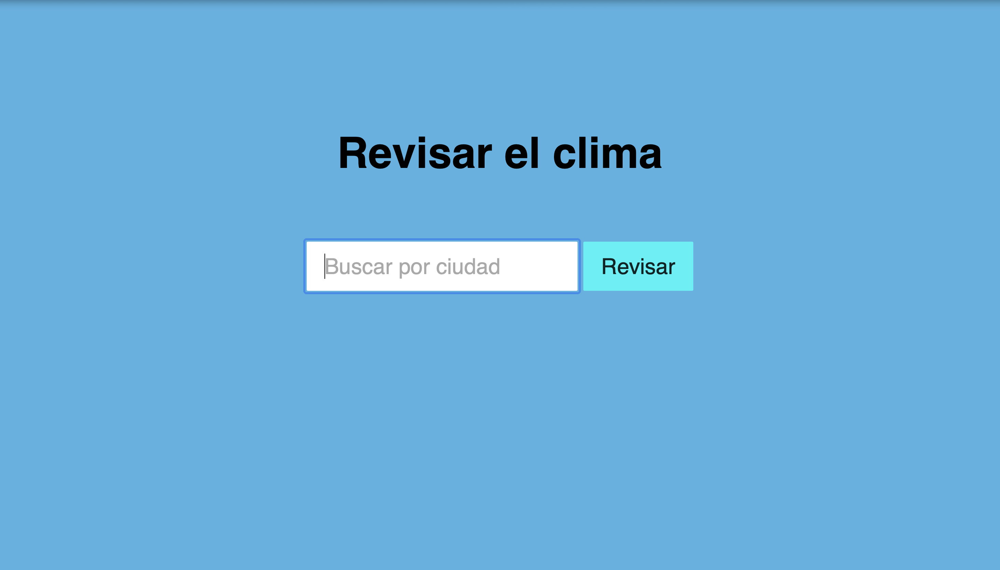
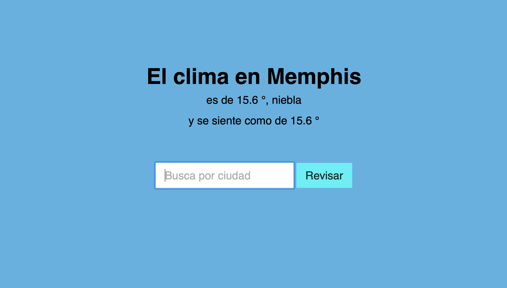
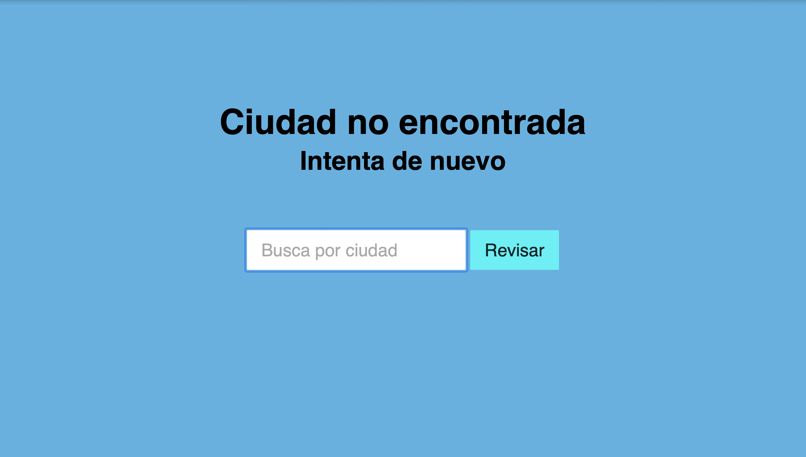

# ClimaApp

Una aplicación web simple en Python para consultar el clima de una ciudad.

## Descripción

ClimaApp utiliza la API de OpenWeatherMap para obtener información meteorológica y la presenta al usuario en una interfaz web amigable.  Permite buscar el clima por nombre de ciudad y muestra la temperatura actual, la descripción del clima y un icono representativo. Tambien puedes conectarla a tu base de datos para cada informacion. 

## Capturas de Pantalla





## Estructura del proyecto

```
climapp/
├── static/             # Archivos estáticos (CSS)
│   └── style.css
├── templates/          # Plantillas HTML
│   ├── error.html      # Página de error
│   ├── index.html      # Página principal
│   └── weather.html    # Página con la información del clima
├── .gitignore          # Archivos ignorados por Git
├── .git                # Directorio de Git
├── .env                # Variables de entorno (API Key)
├── README.md           # Informacion del proyecto
├── requirements.txt    # Dependencias del proyecto
├── structure.txt       # Archivo de estructura (este README)
├── server.py           # Script principal del servidor Flask
└── weather.py          # Módulo para interactuar con la API de OpenWeatherMap
```

## Instalación

1. Clona el repositorio:

```bash
git clone https://github.com/tu_usuario/climapp.git
```

2. Crea un archivo `.env` en la raíz del proyecto y agrega tu clave de API de OpenWeatherMap:

```
API_KEY=tu_clave_api
```

Puedes obtener una clave API gratuita en [https://openweathermap.org/](https://openweathermap.org/).

3. Instala las dependencias:

```bash
pip install -r requirements.txt
```

## Ejecución

1. Inicia la aplicación:

```bash
python server.py
```

2. Abre tu navegador web y visita `http://127.0.0.1:5000/`

## Uso

1. Ingresa el nombre de la ciudad en el campo de búsqueda de la página principal.
2. Haz clic en el botón "Buscar".
3. La información meteorológica de la ciudad se mostrará en una nueva página.

## Contribuciones

Las contribuciones son bienvenidas. Por favor, abre un *issue* o envía un *pull request*.
